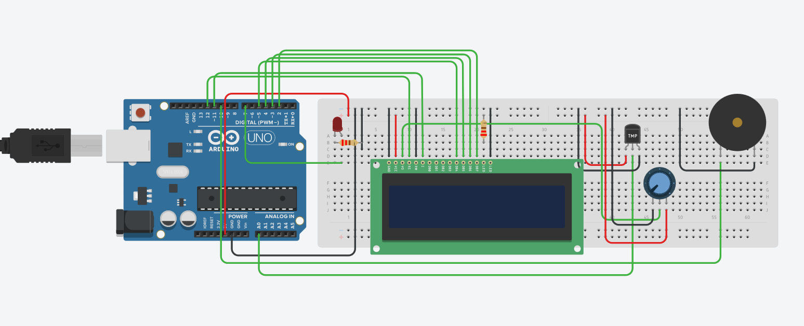
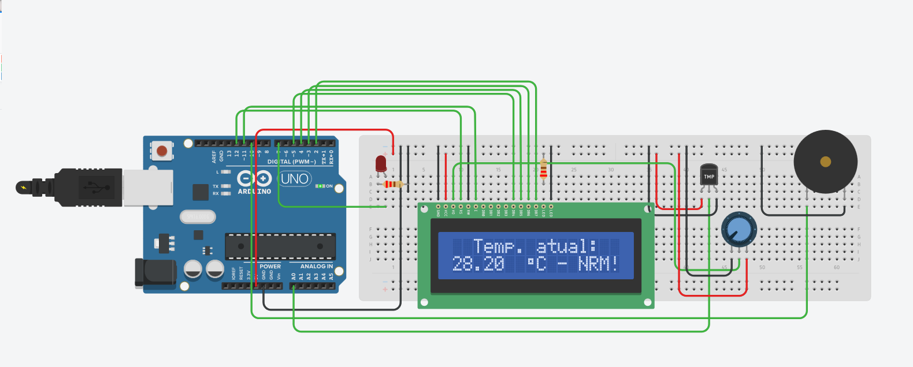
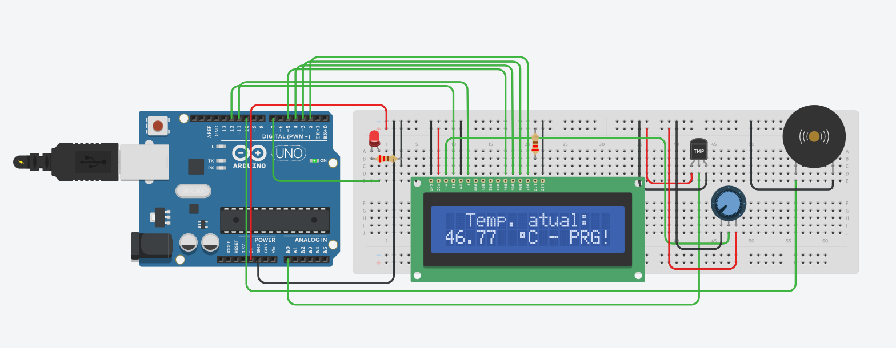

# Monitor-de-Temperatura-Com-LCD

# Projeto realizado com a ajuda da plataforma de simulação "Tinkercad".

Componenentes utilizados:

- 1 Arduino Uno R3;
- 1 Potenciômetro de 10KΩ;
- 1 Display LCD 16x02;
- 1 Buzzer Ativo;
- 1 Sensor de temperatura TMP-36;
- 2 Resistores de 220Ω;
- 1 LED Vermelho.

Esquema de ligação dos componentes no Tinkercad.

 

Exemplo de quando a temperatura está normal.

 

Exemplo de quando a temperatura está acima do estipulado - LED acende e buzzer é ativado.

 
